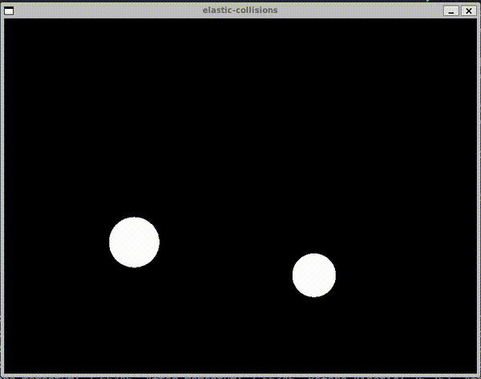

# elastic-collisions

A particle collision simulation in C++ where particles collide elastically visualized using the SFML library. Inspired by Daniel Shiffman's coding challenge questioning why we need physics libraries. You can watch his YouTube video [here](https://www.youtube.com/watch?v=dJNFPv9Mj-Y&t=886s).

## Concept:

In physics, the total kinetic energy of particles will be conserved after a collision. More detailed explanations can be found [here](https://en.wikipedia.org/wiki/Elastic_collision).

## Usage:

- After cloning the repository, create a directory named `build` in the project's root directory.  
- Inside the build directory, run the command: `cmake ..`  
- After the cmake process is complete, run the command: `make`  
- Once compilation finishes, you can run the program using: `./elastic-collisions`